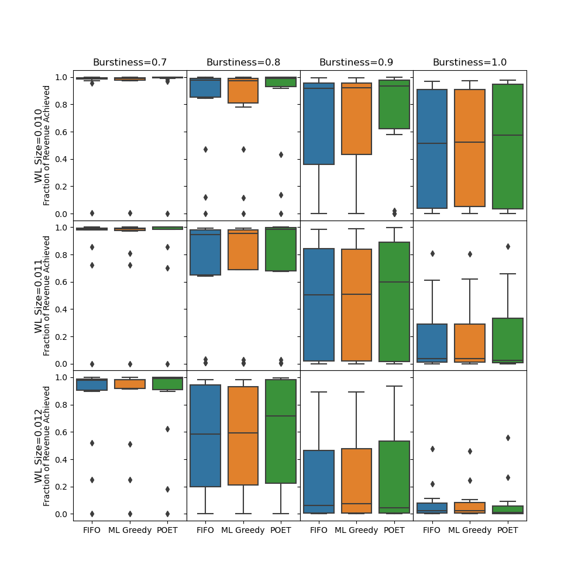

# Overview

This class project is a continuation of my work from my USRA, where I worked in a team on improving spot instance revenue by providing a cooperative framework to give more preference in scheduling spot instances. The main objective is that given a cloud workload composed of virtual machines (VMs) and spot instances (SIs), we must fit all VMs for their entire lifetime (due to SLA constraints) while trying to keep SIs running as long as possible for revenue. It is essentially a temporal bin packing problem, where items (VMs and SIs) have a lifespan and must be assigned to bins (servers). One difficulty we faced in that project is that our ML-based eviction policy predicted scores using only information about the spot instance and required enumerating subsets of spot instances before an eviction decision could be made. Simple algorithms, such as FIFO, did not perform as well but were much faster in terms of decision latency. 

To improve on our previous work, I opted to use an RL model to take advantage of knowledge of the datacenter's state and let it evict until eviction criteria were met to avoid the subset enumeration problem.  
I opted to use [POET](https://arxiv.org/abs/1901.01753) as it allowed me to train a RL model by varying my [workload](https://github.com/Azure/AzurePublicDataset/blob/master/AzureTracesForPacking2020.md) in terms of workload size and burstiness.  

This plot summarizes the results. Going down and towards the right, we increase workload difficulty along two dimensions. POET still performs similarly to other algorithms in the difficulty extremes. In the easiest cases, spot instances almost trivially all fit. In the most difficult cases, spot instances must be evicted as soon as possible to make room for virtual machines. For the in-between cases, POET shows some potential improvements. Overall, this short project showed some promise with around 5% revenue improvements over our previous ML-based approach, while having around a 70% reduction in 99 percentile workload completion time.